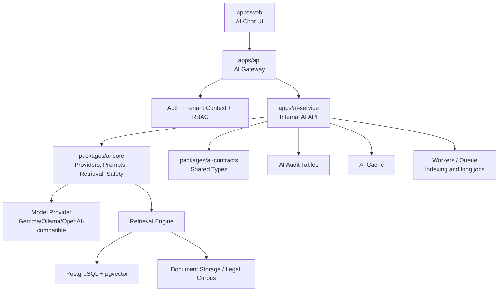
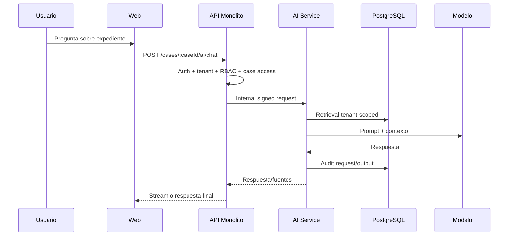

# Temis AI Chat And RAG Plan

Este documento define lo que necesitamos estudiar, decidir y preparar antes de implementar IA conversacional, RAG legal, base vectorial, RBAC especifico de IA, guardrails y estrategia de chunking normativo.

La meta no es agregar un chat generico. La meta es construir un modulo de IA legaltech seguro, trazable, multi-tenant y mantenible.

## Principios

- La IA no reemplaza autorizacion, tenant scope ni reglas de dominio.
- El frontend nunca habla directo con el AI Service.
- El monolito valida usuario, tenant, expediente y permisos antes de pedir IA.
- El AI Service aislado usa credenciales limitadas.
- Todo output legal generado por IA queda marcado como borrador o asistencia.
- La estructura legal es fuente de verdad; los chunks son una representacion tecnica para retrieval.
- Ningun prompt, log o error debe exponer tokens, secretos, PII innecesaria o datos legales fuera de scope.

## Arquitectura Objetivo



## Fase 1 - Interfaz Del Chat

Objetivo: definir la experiencia del usuario sin acoplarla todavia al motor final.

### Decisiones A Estudiar

- Donde vive el chat:
  - panel lateral dentro de expediente;
  - pagina dedicada de asistente;
  - modal/sheet contextual;
  - widget global con contexto activo.
- Alcance inicial:
  - chat sobre expediente;
  - resumen de expediente;
  - consulta sobre normativa;
  - generacion de borradores.
- Estados UX:
  - idle;
  - loading/streaming;
  - error recuperable;
  - sin permisos;
  - sin contexto;
  - respuesta con baja confianza;
  - respuesta lista para guardar como nota o borrador.
- Acciones esperadas:
  - copiar respuesta;
  - guardar resumen;
  - crear borrador;
  - regenerar;
  - dar feedback util/no util;
  - ver fuentes usadas.
- Como mostrar fuentes:
  - articulo citado;
  - documento del expediente;
  - tarea/audiencia/gasto;
  - fecha de version normativa.

### Componentes Sugeridos

```txt
apps/web/app/admin/cases/[id]/_components/ai/
  case-ai-panel.tsx
  case-ai-chat.tsx
  case-ai-message-list.tsx
  case-ai-message.tsx
  case-ai-composer.tsx
  case-ai-sources.tsx
  case-ai-actions.tsx
  case-ai-state.tsx
```

### Dependencias UI

- `@ai-sdk/react` vive en `apps/web`.
- La UI usa hooks de streaming solo contra endpoints del monolito.
- La UI no recibe ni envia `tenantId` como fuente de verdad.

### Criterios De Aceptacion

- El chat respeta dark/light mode.
- El panel funciona en desktop, notebook, iPad y mobile.
- Los mensajes no rompen layout con textos largos.
- Las fuentes se pueden inspeccionar.
- El estado "sin permisos" no revela informacion sensible.

## Fase 2 - Logica Del Chat

Objetivo: definir el circuito completo de una consulta antes de sumar documentos y vectores complejos.

### Flujo Base



### Responsabilidades

`apps/api`:

- valida sesion;
- valida tenant activo;
- valida acceso al expediente;
- valida RBAC;
- firma request interna;
- expone endpoint publico al frontend;
- oculta errores internos del AI Service.

`apps/ai-service`:

- valida firma interna;
- aplica guardrails tecnicos;
- arma contexto;
- llama al provider;
- registra auditoria;
- devuelve respuesta normalizada.

`packages/ai-core`:

- define providers;
- define prompt registry;
- define retrieval;
- define safety/redaction;
- define schemas de salida.

`packages/ai-contracts`:

- tipos de requests;
- tipos de responses;
- codigos de error;
- permisos de IA;
- eventos internos.

### Decisiones A Estudiar

- Streaming vs respuesta completa.
- Memoria de conversacion:
  - por request;
  - por expediente;
  - por usuario;
  - con expiracion.
- Limite de contexto por pregunta.
- Cache de respuestas:
  - resumen de expediente;
  - consulta normativa;
  - nunca cachear chats con datos sensibles sin key tenant/user/case.
- Como cancelar requests largas.
- Como reportar errores del modelo sin filtrar datos.

## Fase 3 - Ampliacion De DB Vectorial

Objetivo: preparar Postgres para corpus legal, documentos del estudio y retrieval hibrido.

### Extension

```sql
CREATE EXTENSION IF NOT EXISTS vector;
```

### Esquema Sugerido

Usar schema dedicado:

```txt
ai
```

Tablas candidatas:

```txt
ai.ai_requests
ai.ai_outputs
ai.ai_feedback
ai.ai_prompt_versions
ai.legal_documents
ai.legal_document_versions
ai.legal_norm_units
ai.legal_norm_chunks
ai.case_document_chunks
ai.embedding_jobs
```

### Corpus Legal Global Vs Datos Tenant

Corpus legal publico:

- Constitucion;
- codigos;
- leyes;
- acordadas;
- jurisprudencia publica, si se incorpora.

Puede ser global, versionado y compartido.

Datos del estudio:

- expedientes;
- documentos;
- notas;
- tareas;
- audiencias;
- gastos.

Deben ser tenant-scoped siempre.

### Modelo Conceptual

```txt
legal_documents
  id
  jurisdiction
  document_type
  title
  source_url
  is_public

legal_document_versions
  id
  legal_document_id
  version_label
  effective_from
  effective_to
  source_hash

legal_norm_units
  id
  legal_document_version_id
  canonical_ref
  unit_type
  parent_unit_id
  article_number
  clause_number
  order_index
  text
  text_hash

legal_norm_chunks
  id
  legal_norm_unit_id
  chunk_index
  content
  content_hash
  embedding_model
  embedding
```

### Indices

- indice HNSW para embeddings;
- indice por `canonical_ref`;
- indice por `document_type`;
- indice por `jurisdiction`;
- indice por `legal_document_version_id`;
- full-text search sobre `content`;
- indices tenant-scoped para chunks privados.

### Retrieval Hibrido

Combinar:

- metadata exacta;
- full-text search;
- vector similarity;
- reranking.

Ejemplo:

```txt
"articulo 14 bis" -> metadata/canonical_ref primero
"tratados internacionales" -> vector + full-text
"vencimientos del expediente" -> datos tenant + case scope
```

## Fase 4 - RBAC Para IA

Objetivo: que IA sea una capacidad autorizada, no una feature abierta.

### Permisos Iniciales

```txt
ai:case_summary
ai:case_chat
ai:draft_create
ai:legal_research
ai:document_index
ai:feedback_create
ai:audit_read
```

### Reglas

- La API valida RBAC antes de invocar AI Service.
- El AI Service valida firma interna y permisos declarados.
- El AI Service no acepta requests directas del navegador.
- El usuario debe tener acceso al expediente antes de preguntar sobre ese expediente.
- `ai:audit_read` debe quedar reservado a roles altos.
- `ai:document_index` no implica permiso para leer todos los documentos.

### Casos De Borde

- usuario sin tenant activo;
- usuario sin acceso al expediente;
- usuario con permiso de chat pero sin permiso de documentos;
- usuario con permiso de resumen pero no de borradores;
- tenant suspendido;
- expediente eliminado/archivado;
- documento privado o restringido.

## Fase 5 - Guardrails

Objetivo: reducir riesgo legal, fuga de datos y acciones peligrosas.

### Guardrails De Entrada

- validar longitud maxima del mensaje;
- bloquear prompts que pidan secretos, tokens o datos de otros tenants;
- normalizar instrucciones de sistema;
- clasificar intencion:
  - consulta normativa;
  - consulta de expediente;
  - generacion de borrador;
  - intento de accion;
  - intento de bypass.

### Guardrails De Contexto

- recuperar solo datos autorizados;
- aplicar tenant scope obligatorio;
- limitar cantidad de chunks;
- evitar mezclar corpus publico con expediente sin citar origen;
- no enviar documentos completos si alcanza con fragmentos.

### Guardrails De Salida

- marcar borradores como no definitivos;
- incluir fuentes cuando la respuesta use normativa o documentos;
- evitar afirmaciones sin fuente en respuestas legales;
- detectar baja confianza;
- impedir instrucciones ilegales, fraude, violencia o evasion;
- no generar presentaciones judiciales finales sin revision humana.

### Auditoria

Registrar:

- `requestId`;
- `tenantId`;
- `userId`;
- `caseId`, si aplica;
- permiso usado;
- modelo;
- prompt version;
- fuentes recuperadas;
- duracion;
- resultado;
- error normalizado;
- feedback posterior.

No registrar:

- access tokens;
- refresh tokens;
- secretos;
- prompts con datos sensibles completos si no es estrictamente necesario.

## Fase 6 - Estrategia De Chunkificacion

Objetivo: representar leyes y documentos de forma actualizable, trazable y consultable.

### Regla Principal

No chunkear leyes por tamano fijo como criterio primario.

La unidad base debe ser la estructura normativa:

```txt
Documento
  Version
    Parte
      Libro / Titulo / Capitulo / Seccion
        Articulo
          Inciso
            Apartado
```

### Constitucion Y Preambulo

- Preambulo: chunk propio.
- Articulos cortos: un chunk por articulo.
- Articulos largos: dividir por inciso/parrafo.
- Mantener siempre `canonical_ref`.

Ejemplos:

```txt
CN Preambulo
CN Art. 14
CN Art. 14 bis
CN Art. 75 inc. 22
```

### Separacion Clave

```txt
legal_norm_units = fuente legal estable
legal_norm_chunks = representacion tecnica para embeddings
```

Si cambia un articulo:

```txt
1. detectar unidad modificada
2. invalidar chunks de esa unidad
3. rechunkear solo esa unidad
4. regenerar embeddings de esa unidad
5. conservar version historica si aplica
```

### Metadata Obligatoria

```txt
jurisdiction
document_type
document_title
version_label
effective_from
effective_to
unit_type
canonical_ref
article_number
clause_number
parent_unit_id
order_index
content_hash
embedding_model
```

### Configuracion Inicial

- Articulo completo si entra en 700-1200 tokens.
- Overlap 0 si no se divide la unidad.
- Overlap 80-150 tokens si se divide una unidad larga.
- No mezclar dos articulos en un mismo chunk.
- No mezclar dos leyes en un mismo chunk.
- No mezclar versiones normativas en un mismo chunk.

### Documentos Del Expediente

Para escritos, PDFs y notas del estudio:

- respetar estructura detectada: titulo, seccion, parrafo;
- si no hay estructura, usar splitter recursivo por parrafos/oraciones;
- metadata tenant-scoped obligatoria;
- asociar a `caseId` y `documentId`;
- mantener pagina o rango de pagina cuando venga de PDF;
- permitir reindexar solo documento modificado.

## Fase 7 - Testing Y Evidencia

### Backend / AI Service

- tests positivos de permisos;
- tests negativos de RBAC;
- tests cross-tenant;
- tests de firma interna;
- tests de validacion de input;
- tests de retrieval con metadata exacta;
- tests de fallback vectorial;
- tests de versionado normativo.

### Frontend

- chat sin permisos;
- chat con permisos;
- loading/streaming;
- error del modelo;
- fuentes visibles;
- responsive iPad/mobile;
- dark/light mode.

### RAG

- consulta exacta: "articulo 14 bis";
- consulta semantica: "derecho a trabajar";
- consulta historica por version;
- consulta sin respuesta;
- consulta que intenta pedir datos de otro tenant.

## Orden Recomendado

1. UI estatica del chat y estados.
2. AI Gateway en `apps/api` con RBAC pero provider mock.
3. AI Service aislado con endpoint interno firmado.
4. Auditoria minima.
5. DB vectorial y schema `ai`.
6. Corpus legal inicial: Constitucion + Preambulo.
7. Chunking estructural y embeddings.
8. Retrieval hibrido.
9. Chat real con fuentes.
10. Guardrails avanzados y evaluaciones.

## Riesgos Principales

- Filtracion cross-tenant por retrieval mal filtrado.
- Respuestas legales sin fuente.
- Chunking fijo que mezcle articulos o versiones.
- Logs con datos sensibles.
- UI que parezca producir escritos finales sin revision.
- Costos y latencia si se indexan documentos grandes sin workers.

## Documentos Que Deberian Actualizarse Al Implementar

- `docs/architecture/DECISIONS.md`
- `docs/architecture/MULTITENANCY.md`
- `docs/architecture/RBAC.md`
- `docs/architecture/AUDIT.md`
- `docs/database/DATABASE_SOURCE_OF_TRUTH.md`
- `docs/product/ROADMAP.md`
